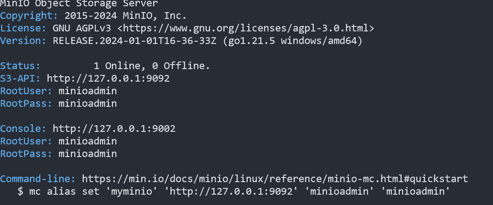

- - -
## 平台简介

 

> RuoYi-Vue-Plus 是重写 RuoYi-Vue 针对 `分布式集群与多租户` 场景全方位升级(不兼容原框架)

> 项目代码、文档 均开源免费可商用 遵循开源协议在项目中保留开源协议文件即可 
活到老写到老 为兴趣而开源 为学习而开源 为让大家真正可以学到技术而开源

> 系统演示: [传送门](https://plus-doc.dromara.org/#/common/demo_system)

> 前端项目地址: [plus-ui](https://github.com/xiansongq/lvju-ui)

> 文档地址: [plus-doc](https://plus-doc.dromara.org) - [plus-doc(国内备用)](https://dromara.gitee.io/plus-doc)

> 后端项目启动请查看说明文档

## 关于OOS文件上传的配置
本项目的文件使用OOS存储的方式进行存储，目前支持阿里云、腾讯云、minio等oos存储。下面介绍如何使用minio进行存储。
[minio下载](https://min.io/download#/windows) \
[中文文档](https://www.minio.org.cn/docs/minio/kubernetes/upstream/index.html) \
下载之后会有一个minio.exe文件。执行命令`minio.exe  server D:\ruoyi\upload --console-address "127.0.0.1:9002" -address "127.0.0.1:9092"`

前端访问 127.0.0.1:9002 即可 。
当然还需要在项目的文件上传部分配置自己的本地oos信息。

## 参考文档

使用框架前请仔细阅读文档重点注意事项
 
>[初始化项目 必看](https://plus-doc.dromara.org/#/ruoyi-vue-plus/quickstart/init)
>>[https://plus-doc.dromara.org/#/ruoyi-vue-plus/quickstart/init](https://plus-doc.dromara.org/#/ruoyi-vue-plus/quickstart/init)
>
>[专栏与视频 入门必看](https://plus-doc.dromara.org/#/common/column)
>>[https://plus-doc.dromara.org/#/common/column](https://plus-doc.dromara.org/#/common/column)
>
>[部署项目 必看](https://plus-doc.dromara.org/#/ruoyi-vue-plus/quickstart/deploy)
>>[https://plus-doc.dromara.org/#/ruoyi-vue-plus/quickstart/deploy](https://plus-doc.dromara.org/#/ruoyi-vue-plus/quickstart/deploy)
> 
>[参考文档 Wiki](https://plus-doc.dromara.org)
>>[https://plus-doc.dromara.org](https://plus-doc.dromara.org)
> 
>[参考文档(国内备份)](https://dromara.gitee.io/plus-doc)
>>[https://dromara.gitee.io/plus-doc](https://dromara.gitee.io/plus-doc)

## 软件架构图

